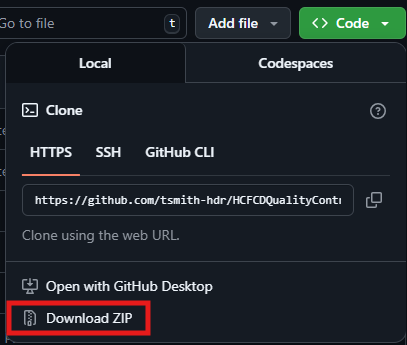

# HCFCDQualityControl-ArcGISToolbox
ArcGIS Python Toolbox containing all the tools needed for the Quality Control process of the HCFCD SAFER Project.

## Tools
There are three toolsets "Data Management Reports" and "Metadata Mangement"

### Backup Management
- <i>Backup Services</i>: Tool to be used to create a local backup of the current Feature Services in the PDS. The process will create a Feature Dataset in the local File GDB for each of the AGOL Folders. Each layer in a Feature Service will be exported to Feature Class. If there is a conflict in naming, the subsequent Feature Classes with have a suffix of _1, _2, _3, and so on. The tool exports an excel report, in this report each of the exported Feature Classes note which parent service and child service layer the data came from and the new table name. The Local File GDB data is compressed which will make the data read-only preventing anyone editing the data. The exported Feature Class will retain GLobal IDs from the service which will allow future querying based on individual records in the table. The backup can filtered to only run on certain AGOL Folders, and will create a zipped folder with the Local File GDB and excel report and copy to the backup directory of choosing. There is an optional parameter of sending a confirmation email, this email and all recipients need to be an @hdrinc.com email. 

### Data Management Reports
- <i>Compare Spatial References (Excel Report):</i> Pulls the Spatial Reference EPSG/WKID of each item from across the Local File Geodatabase and  AGOL Service. The project uses EPSG WKID <b>6588</b> (NAD 1983 (2011) StatePlane Texas South Central FIPS 4204 (Feet))
- <i>Compare Storage Locations (Excel Report):</i> Checks the existance of the item between the Local File Geodatabase, AGOL Services, and the Data Catalog.
- (Deprecated) <i>Get Feature Class Dates (Excel Report):</i> Pulls the Created, Modified, and Last Accessed Dates of each table listed in the Data Catalog. 

### Metadata Management
The overall workflow will be the metadata from the Local File Geodatabase item will be pushed to the associated AGOL Service listed in the Data Catalog (Excel). the metadata items summary, access constraints, and credits have specific structure and will overwrite any previously entered values in the Local FGDB and AGOL Service. 
- <i>Batch Update Service Metadata (Excel Report):</i> This tool only updates the service item's portal metadata. The tool allows the user to filter items by type and folder location. *Please note that this tool cannot replace the current metadata with a blank or null entry.
- <i>Compare Metadata (Excel Report):</i> Iterates over the Data Catalog Items and returns an excel report comparing Title, Description, Summary, Tags, Credits, and Access Information for each item in the Local File GDB and the AGOL Service. Can be returned as either HTML or Plain Text. This tool will be used to inspect what items need to be updated.
- <i>Retrieve Item's Metadata (HTML):</i> Consoles out the metadata of either the raster or feature class with the description returned in HTML
- <i>Update Metadata (Batch):</i> This will update all of items. There is an optional parameter to have the process include/exclude ceertian Web App Categories/Feature Datasets in the Local FGDB.
- <i>Update Metadata (Individual):</i> If only needing to update a few items, this tool allows the user to select the Local FGDB items that will be updated.

## Initial Setup
- If you do not have Git or GitHub, you can download the repository as a zipped folder. \

- Extract the folder to the project. 
Within the APRX make a new folder connection to the extracted directory. 
- When you expand the directory you will be able to use the toolbox normally.

